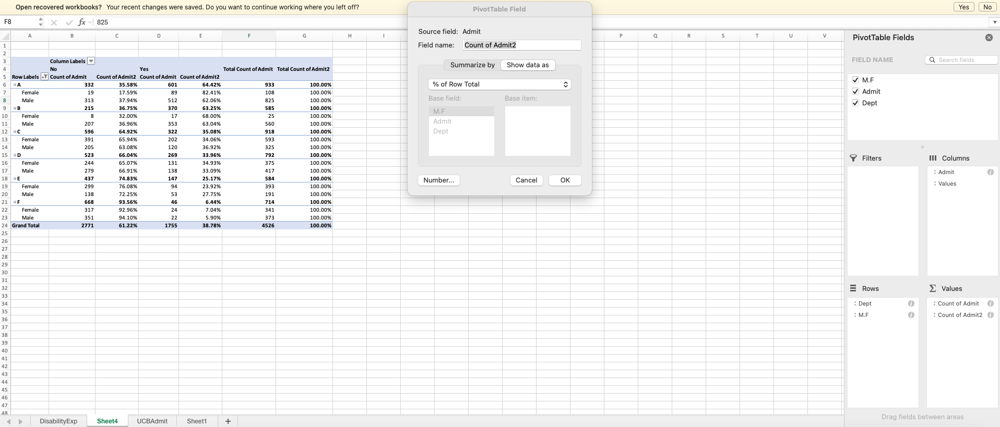

```{r setup, include=FALSE}
library(tufte)
# invalidate cache when the tufte version changes
knitr::opts_chunk$set(cache.extra = packageVersion('tufte'), echo=FALSE, message=FALSE, warning=FALSE)
options(htmltools.dir.version = FALSE)
load("./../ProbData.RData")
```

## Question 1

1.	A machine produces defective parts with probabilities that depend on the state of repair. If the machine is in good working order, it produces defective parts with probability 0.02. If the machine is wearing down, it produces defective parts 10% of the time. If the machine is in need of repairs, then it produces defective parts 30% of the time. The probability that the machine is in good working order is 0.8; the probability that the machine is wearing down or in need of repair is 0.1 (for each).

- a.	Compute the probability that a randomly selected completed part is defective. NB: There is no difference in the rate of production among the repair states, only a difference in the number of defects. 

**There is a `0.02*0.8 + 0.1*0.1 + 0.1*0.3 = 0.056` total probability of errors.**

- b.	A factory consists of three machines. One machine is in good working order. One machine is wearing down and one is in need of repairs. All three machines produce at the same rate. You are given a defective part; what is the probability that each machine produced it?  

**Good working order is 0.02, wearing down is 0.1, in need of repairs is 0.3. Each, times one-third yields 0.14.  So P(INR) = 5/7; P(WD) = 5/21; P(GWO)= 1/21.**

## Question 2

2.	The Monty Hall problem is fashioned after an old television game show. You are a contestant and you are faced with three doors, labeled A, B, and C. Behind one of the three doors is a new car. The other two doors contain goats. The drama is created by a choice you will make though you actually make two. First, you choose a door. After you have chosen, Monty will show you one of the two doors that you did not choose and there will be a goat behind that door. At this point is the drama, will you keep your original choice or will you switch to the remaining unopened door?
To solve the problem, provide a decision-tree depicting the choices and outcomes. Is it better to stick with your choice or to switch?

**It is better to switch.  Monty shows you a door with a goat, no matter what.  So the original probability that you are correct [stay] is 1/3 while the probability that you are correct if you switch must be 2/3.  The key to the tree is that Monty randomizes the door he shows you only if you were initially correct.**

## Question 3

3.	For a variety of reasons, various forms of drug screening are utilized by employers throughout the United States. Here we confront a decision over pre-employment screening. Suppose a test is 99% accurate for actual Users of a given drug and 95% accurate for non-Users of the same substance. Moreover, we know that Users make up 10% of the population. How we know these things is an appropriate question and in some cases, the answers may not be all that satisfying.

- a.	What is the probability of a positive test for a random individual with no knowledge of their usage status?   `0.99*0.1 + 0.05*0.9 = 0.099+0.045=0.144.`. **99 percent of the 10 percent users and 5 percent of the 90 percent non-users.**
- b.	If someone tests positive, what is the probability that they are an actual user of the drug?   **This is 0.099 above and it is taken as a percentage of the total, 0.144.  This is 0.6875.**
- c.	Is this test useful as a pre-employment screen? Assuming that the employee is chosen for reasons unrelated to this, what are the costs and benefits?   **Just over one-third of the positives are actual users so it is not great but it is better than nothing.**

## Question 4

4.	One of the most important metrics for Facebook is something known as a Markov matrix – a matrix linking current and past realizations of some outcome. Their particular interest is in the use of an experimental Facebook shopping platform per month. Consider the following subset of data for a recent month. There are a few features of this platform that make it unlike most others; it is by invitation only so the size of both the yes and no populations are actually known (this is almost never true in any precise way).

- a.	What is the conditional probability of being a current user of the shopping platform given that you previously used the platform?   `r margin_note("There were 184,000 users and 164,000 remain; the probability is 0.8913.")`
- b.	What is the rate of *user loss* – the conditional probability of becoming a non-user of the platform given use in the prior period?   `r margin_note("One minus the above; this probability is 0.1087.")`
- c.	Is the platform growing or shrinking? How would you measure that? Explain/defend your answer?   `r margin_note("The platform is growing; they lost 20,000 but gained 24,000.")`
- d.	What is the probability of not being a user of the platform in the current period?   `r margin_note("1972000 of 2160000 is 0.913.")`

```{=latex}
\begin{tabular}{llccc}
& & \multicolumn{2}{c}{Current User} & \\
& & Yes & No & Total \\
Prior User & Yes & 164000 & 20000 & \\
& No & 24000 & 1952000 & \\
& Total & & &
\end{tabular}
```


# Data Examples

## Disability Expenditures

The data set presented is designed to represent a sample of 1,000 DDS consumers (which provides a 95% confidence interval with a margin of error of $\pm$ 3.5\% for this 250,000 consumer population). The data set includes six variables (i.e., fields) which are: ID, age cohort/age (binned/unbinned), gender, expenditures, and ethnicity. NB: The data set originated from DDS’s Client Master File. In order to remain in compliance with California State Legislation, the data have been altered to protect the rights and privacy of specific individual consumers. The provided data set is based on actual attributes of consumers. 

**ID** is the unique identification code for each consumer. It is similar to a social security number and used for identification purposes. 

**Age cohort/age** is a key variable in the case exercise. While age is a legal basis for discrimination in many situations, age is not an attribute that would be considered in a discrimination claim for this particular population. The purpose of providing funds to those with developmental disabilities is to help them live like those without disabilities. As consumers get older, their financial needs increase as they move out of their parent’s home, etc. Therefore, it is expected that expenditures for older consumers will be higher than for the younger consumers. 

We have included both binned (**Age cohort**) and unbinned (**Age**) variables to represent a consumer’s age. The binned age variable is represented in the data set as six age cohorts. Each consumer is assigned to an age cohort based on their years since birth. The six cohorts include: 0-5 years old, 6-12, 13-17, 18-21, 22-50, and 51+. The cohorts are established based on the amount of financial support typically required during a particular life phase. 

The 0-5 cohort (preschool age) has the fewest needs and requires the least amount of funding. For the 6-12 cohort (elementary school age) and 13-17 (high school age), a number of needed services are provided by schools. The 18-21 cohort is typically in a transition phase as the consumers begin moving out from their parents’ homes into community centers or living on their own. The majority of those in the 22-50 cohort no longer live with their parents but may still receive some support from their family. Those in the 51+ cohort have the most needs and require the most amount of funding because they are living on their own or in community centers and often have no living parents. 

**Gender** is included in the data set as another variable to consider because it is an attribute on which many discrimination cases are based. 

**Expenditures** variable represents the annual expenditures the State spends on each consumer in supporting these individuals and their families. It is important that students realize this is the amount each consumer receives from the State. Expenditures include services such as: respite for their families, psychological services, medical expenses, transportation, and costs related to housing such as rent (especially for adult consumers living outside their parent’s home). 

**Ethnicity** is the key demographic variable in the data set as it pertains to the case. Eight ethnic groups are represented in the data set. These groups reflect the demographic profile of the State of California.  Our key area of interest will become Hispanic and White, non-Hispanic comparisons.

# Questions for Discrimination

## Averages

`r newthought('Average Expenditures')`

1.	What is the average of expenditures for: (a) all males vs. all females, 

```{marginfigure, echo = TRUE} 
The average for females is 18,129.61 dollars and the average for males is 18001.2 dollars.
```

```{r, include=FALSE}
library(radiant)
```

```{r}
result <- pivotr(
  CADDS, 
  cvars = "Gender", 
  nvar = "Expenditures", 
  nr = Inf
)
# summary(result)
dtab(result, caption = "") %>% render()
```

(b) all Hispanics and all White, non-Hispanics, 

```{marginfigure, echo = TRUE} 
The average expenditure for Hispanic clients is 11,065.57 dollars.  The average expenditure for White not Hispanic clients is 24,697.55 dollars.
```

```{r}
result <- pivotr(
  CADDS, 
  cvars = "Ethnicity", 
  nvar = "Expenditures", 
  nr = Inf
)
# summary(result)
dtab(result, caption = "") %>% render()
```


(c) all 22-50 year olds, `r margin_note("The average expenditure for 22 to 50 year old clients is 40,209.28 dollars.")`


```{r}
result <- pivotr(
  CADDS, 
  cvars = "Age.Cohort", 
  nvar = "Expenditures", 
  nr = Inf
)
# summary(result)
dtab(result, caption = "") %>% render()
```


(d) all male, White non-Hispanics, `r margin_note("The average expenditure for male and White not Hispanic clients is 24,573.80 dollars.")`


```{r}
result <- pivotr(
  CADDS, 
  cvars = c("Ethnicity", "Gender"), 
  nvar = "Expenditures", 
  nr = Inf
)
# summary(result)
dtab(result, caption = "") %>% render()
```


(e) all Asian, 22-50 year olds? `r margin_note("The average expenditure for Asian 22 to 50 year old clients is 39,580.52 dollars.")`


```{r}
result <- pivotr(
  CADDS, 
  cvars = c("Ethnicity", "Age.Cohort"), 
  nvar = "Expenditures", 
  nr = Inf
)
# summary(result)
dtab(result, caption = "") %>% render()
```

## Medians

`r newthought('Median Expenditures')`

2.	What is the median of expenditures for: 
(a) all males vs. all females, `r margin_note("The median expenditure for female clients is 6,400 dollars and the median expenditure for male clients is 7,219 dollars; the male median is about 12.5 percent larger than the female median.")`

```{r}
result <- pivotr(
  CADDS, 
  cvars = "Gender", 
  nvar = "Expenditures", 
  fun = "median", 
  nr = Inf
)
# summary(result)
dtab(result, caption = "") %>% render()
```

(b) all Hispanics and all White, non-Hispanics, `r margin_note("The median expenditure for Hispanic clients is 3,952 dollars and the median expenditure for White not Hispanic clients is 15,718 dollars.  This difference is large.")`


```{r}
result <- pivotr(
  CADDS, 
  cvars = "Ethnicity", 
  nvar = "Expenditures", 
  fun = "median", 
  nr = Inf
)
# summary(result)
dtab(result, caption = "") %>% render()
```


(c) all 13-17 year olds, `r margin_note("The median expenditure for 13 to 17 year old clients is 3,952 dollars.  Note the similarity with the above.")`


```{r}
result <- pivotr(
  CADDS, 
  cvars = "Age.Cohort", 
  nvar = "Expenditures", 
  fun = "median", 
  nr = Inf
)
# summary(result)
dtab(result, caption = "") %>% render()
```


(d) all male, White non-Hispanics, `r margin_note("The median expenditure for White not Hispanic male clients is 27,390.50 dollars.")`


```{r}
result <- pivotr(
  CADDS, 
  cvars = c("Gender", "Ethnicity"), 
  nvar = "Expenditures", 
  fun = "median", 
  nr = Inf
)
# summary(result)
dtab(result, caption = "") %>% render()
```


(e) all Asian, 13-17 year olds? `r margin_note("The median expenditure for 13 to 17 year old Asian clients is 3,628.50 dollars.")`


```{r}
result <- pivotr(
  CADDS, 
  cvars = c("Age.Cohort", "Ethnicity"), 
  nvar = "Expenditures", 
  fun = "median", 
  nr = Inf
)
# summary(result)
dtab(result, caption = "") %>% render()
```

## Elements of the Interquartile Range

`r newthought('The middle 50% of expenditures')`

3.	What is the range of the middle 50% of expenditures for: (a) all males vs. all females, `r margin_note("The middle fifty percent of expenditures for female clients ranges from 2872.50 to 39,487.50 dollars and for male clients ranges from 2,954 to 37,201 dollars.  This range, for males, is entirely contained in the range for females.")`

```{r}
result <- explore(
  CADDS, 
  vars = "Expenditures", 
  byvar = "Gender", 
  fun = c("p25", "p75"), 
  nr = Inf
)
# summary(result)
dtab(result, caption = "") %>% render()
```


(b) all Hispanics and all White, non-Hispanics, `r margin_note("The middle fifty percent of expenditures for Hispanic clients ranges from 2331.25 to 10,292.50 dollars and for White not Hispanic clients ranges from 3,977 to 43,134 dollars.")`

```{r}
result <- explore(
  CADDS, 
  vars = "Expenditures", 
  byvar = "Ethnicity", 
  fun = c("p25", "p75"), 
  nr = Inf
)
# summary(result)
dtab(result, caption = "") %>% render()
```


(c) all 13-17 year olds, `r margin_note("The middle fifty percent of expenditures for 13 to 17 year old clients ranges from 3,306.50 to 4,665.50 dollars.  Expenditures seem to balloon for adults; we can roughly compare this range to that in subpart (e).")`


```{r}
result <- explore(
  CADDS, 
  vars = "Expenditures", 
  byvar = "Age.Cohort", 
  fun = c("p25", "p75"), 
  nr = Inf
)
# summary(result)
dtab(result, caption = "") %>% render()
```


(d) all male, White non-Hispanics, and `r margin_note("The middle fifty percent of expenditures for male and White not Hispanic clients ranges from 4195.25 to 40,817.50 dollars.")`

```{r}
result <- explore(
  CADDS, 
  vars = "Expenditures", 
  byvar = c("Gender", "Ethnicity"), 
  fun = c("p25", "p75"), 
  nr = Inf
)
# summary(result)
dtab(result, caption = "") %>% render()
```

(e) all Asian, 18-21 year olds? `r margin_note("The middle fifty percent of expenditures for clients 18 to 21 years of age and Asian ranges from 7683 to 11,282 dollars.")`


```{r}
result <- explore(
  CADDS, 
  vars = "Expenditures", 
  byvar = c("Ethnicity", "Age.Cohort"), 
  fun = c("p25", "p75"), 
  nr = Inf
)
# summary(result)
dtab(result, caption = "") %>% render()
```

```{r, fig.margin=TRUE} 
CADDS %>% ggplot() + aes(x=Expenditures, y=Gender, color=Gender) + geom_violin(alpha=0.2, adjust=0.5) + geom_boxplot(alpha=0.5) + scale_color_viridis_d() + labs(title="Expenditures: Violin and Boxplots by Gender") + theme_minimal()
```

## Summary Thoughts and Interpretation

4.	Does discrimination in expenditures exist? There are two relevant potential forms of actionable discrimination: gender and ethnicity. Evaluate these two questions with the appropriate pivot table equivalent defined for each.

```{r, fig.margin=TRUE} 
CADDS %>% filter(Ethnicity %in% c("Hispanic", "White not Hispanic")) %>% ggplot() + aes(x=Expenditures, y=Ethnicity, color=Ethnicity) + geom_violin(alpha=0.2, adjust=0.5) + geom_boxplot(alpha=0.5) + scale_color_viridis_d() + labs(title="Expenditures: Violin and Boxplots by Ethnicity") + theme_minimal()
```


**Not in gender, perhaps in ethnicity, where there is wide disparity.**.


5.	It is claimed that there are important disparities between Hispanic and White, not Hispanic. Is this true? Filter only Hispanics and White, not Hispanic. 6. After filtering only Hispanics and White, not Hispanic, compare the two groups by Age Cohort. What seems to be going on?

```{r, fig.fullwidth=TRUE} 
CADDS %>% filter(Ethnicity %in% c("Hispanic", "White not Hispanic")) %>% ggplot() + aes(x=Expenditures, y=Ethnicity, color=Ethnicity, facet=Age.Cohort) + geom_violin(alpha=0.2, adjust=0.5) + geom_boxplot(alpha=0.5) + scale_color_viridis_d() + coord_flip() + facet_wrap(vars(Age.Cohort), scales = "free_y") + labs(title="Expenditures: Violin and Boxplots by Ethnicity and Age Cohort") + theme_minimal() + theme(axis.text.x = element_text(angle = 45, hjust = 1, vjust = 1))
```

> The apparent disparities seem to be accounted for by a different underlying age distribution among the two groups as the within age group comparisons show no obvious differences.  


```{r}
result <- explore(
  CADDS, 
  vars = "Expenditures", 
  byvar = "Ethnicity", 
  fun = c("mean", "n_obs"), 
  data_filter = "Ethnicity=='White not Hispanic' | Ethnicity=='Hispanic'", 
  nr = Inf
)
# summary(result)
dtab(result, caption = "") %>% render()
```


```{r}
result <- explore(
  CADDS, 
  vars = "Expenditures", 
  byvar = c("Age.Cohort", "Ethnicity"), 
  fun = c("mean", "n_obs"), 
  data_filter = "Ethnicity=='White not Hispanic' | Ethnicity=='Hispanic'", 
  nr = Inf
)
# summary(result)
dtab(result, caption = "") %>% render()
```


Consider the following additional issues keeping in mind that the data are a random sample from a broader population. (1) What is the relationship between age cohort and ethnicity for the comparison of White and Hispanic? (2) Are expenditures different by age cohorts? (3) How do the previous two answers interact to influence claims of discrimination?

> In the right column above, there are far more Hispanic than White not Hispanic clients in the age cohorts under the age of 21, but in the older cohorts, this trend reverses and the vast majority of clients are White not Hispanic.  When we note that expenditures are related to age, the apparent discrepancy in expenditures is to be expected to result from this distribution of ages among clients of varying ethnicities.


# Berkeley Discrimination

Is there evidence of sex bias in admission practices? Data on admissions to the University of California at Berkeley graduate programs in six departments are presented for the population of applicants. Admit measures whether or not the applicant was admitted; M.F measures the gender of the applicant; Dept measures the department in a classification ranging from A to F.

*	Provide a table of M.F and Admit.

```{r fig.width = 7, fig.height = 17.23, dpi = 96}
result <- cross_tabs(
  UCBAdmit, 
  var1 = "M.F", 
  var2 = "Admit", 
)
summary(
  result, 
  check = c("observed", "row_perc")
)
```

```{r, fig.margin=TRUE}
{ plot(
  result, 
  check = c("row_perc"), 
  custom = FALSE
) + theme_minimal() }
```

## Conditional Probability

*	Provide the two relevant tables of conditional probabilities for that table.

```{r fig.width = 7, fig.height = 17.23, dpi = 96}
result <- cross_tabs(
  UCBAdmit, 
  var1 = "M.F", 
  var2 = "Admit", 
)
summary(
  result, 
  check = c("observed", "row_perc", "col_perc")
)
```

```{r, fig.margin=TRUE}
{ plot(
  result, 
  check = c("row_perc", "col_perc"), 
  custom = FALSE
) + theme_minimal() }
```

## Some questions....

Some questions....

1.	Are men and women admitted to graduate programs at the same rate?

> No.  Women have a 0.3 probability of admission while men have a 0.45 probability of admission.

2.	Display and tabulate applications by department.

::: {.fullwidth}

:::

## Results {.tabset}

### Department A

```{r}
result <- cross_tabs(
  UCBAdmit, 
  var1 = "M.F", 
  var2 = "Admit", 
  data_filter = "Dept=='A'"
)
```

```{r, fig.margin=TRUE}
plot(result, check = c("observed", "row_perc"), custom = FALSE)
```

```{r}
summary(result, check = c("observed", "row_perc"))
```

### Department B

```{r}
result <- cross_tabs(
  UCBAdmit, 
  var1 = "M.F", 
  var2 = "Admit", 
  data_filter = "Dept=='B'"
)
```

```{r, fig.margin=TRUE}
plot(result, check = c("observed", "row_perc"), custom = FALSE)
```

```{r}
summary(result, check = c("observed", "row_perc"))
```


### Department C

```{r}
result <- cross_tabs(
  UCBAdmit, 
  var1 = "M.F", 
  var2 = "Admit", 
  data_filter = "Dept=='C'"
)
```

```{r, fig.margin=TRUE}
plot(result, check = c("observed", "row_perc"), custom = FALSE)
```

```{r}
summary(result, check = c("observed", "row_perc"))
```


### Department D

```{r}
result <- cross_tabs(
  UCBAdmit, 
  var1 = "M.F", 
  var2 = "Admit", 
  data_filter = "Dept=='D'"
)
```

```{r, fig.margin=TRUE}
plot(result, check = c("observed", "row_perc"), custom = FALSE)
```

```{r}
summary(result, check = c("observed", "row_perc"))
```

### Department E

```{r}
result <- cross_tabs(
  UCBAdmit, 
  var1 = "M.F", 
  var2 = "Admit", 
  data_filter = "Dept=='E'"
)
```

```{r, fig.margin=TRUE}
plot(result, check = c("observed", "row_perc"), custom = FALSE)
```

```{r}
summary(result, check = c("observed", "row_perc"))
```

### Department F

```{r}
result <- cross_tabs(
  UCBAdmit, 
  var1 = "M.F", 
  var2 = "Admit", 
  data_filter = "Dept=='F'"
)
```

```{r, fig.margin=TRUE}
plot(result, check = c("observed", "row_perc"), custom = FALSE)
```

```{r}
summary(result, check = c("observed", "row_perc"))
```

## {-}

3.	Do any departments show differences in admissions rates by gender?

Not substantial differences and not systematically favoring either gender.

4.	Discuss 1 and 2 in light of claims of discrimination.

> Women and men apply to different mixes of departments and it happens that women tended toward those with lower admission rates.  However, within any department, there is little evidence of significant disparity.  The graphic below shows the raw counts of male and female applicants by admission status.  If departments differ in their underlying probability of admission and in their candidate pools, then gender discrepancies can result from the choices of the various genders rather than the genders of the various decisions.

```{r, fig.fullwidth = TRUE}
{ggplot(UCBAdmit) +
  aes(x = M.F, fill = Admit) +
  geom_bar(position = "dodge") +
  scale_fill_viridis_d(option = "viridis", direction = 1) +
  theme_minimal() + coord_flip() } / {ggplot(UCBAdmit) +
  aes(x = M.F, fill = Admit, facet=Dept) +
  geom_bar(position = "dodge") + coord_flip() +
  scale_fill_viridis_d(option = "viridis", direction = 1) +
  facet_wrap(vars(Dept)) +
  theme_minimal()
}
```


5.	Provide a graphic that showcases the apparent disparities and a graphic that dispels them that combines all three dimensions of the table.

The top panel showcases the aggregate disparity: 45% vs. 30%.

The bottom panel shows that in almost all departments, women are admitted at a higher rate than men except in Deparments C and E and the differences in those departments are small.

```{r, fig.fullwidth = TRUE}
{ggplot(UCBAdmit) +
  aes(x = M.F, fill = Admit) +
  geom_bar(position = "fill") +
  scale_fill_viridis_d(option = "viridis", direction = 1) +
  theme_minimal() + coord_flip() } / {ggplot(UCBAdmit) +
  aes(x = M.F, fill = Admit, facet=Dept) +
  geom_bar(position = "fill") + coord_flip() +
  scale_fill_viridis_d(option = "viridis", direction = 1) +
  facet_wrap(vars(Dept)) +
  theme_minimal()
}
```


```{r bib, include=FALSE}
# create a bib file for the R packages used in this document
knitr::write_bib(c('base', 'rmarkdown'), file = 'skeleton.bib')
```
